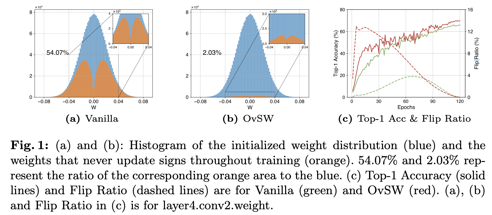

# [ECCV 2024] OvSW: Overcoming Silent Weights for Accurate Binary Neural Networks ([Paper Link](https://arxiv.org/abs/2407.05257))

[Jingyang Xiang](https://jingyangxiang.github.io/), Zuohui Chen, Siqi Li, Qing Wu, [Yong Liu](https://april.zju.edu.cn/team/dr-yong-liu/)

Pytorch implementation of OvSW in ECCV 2024.

Main code can be found in ```./model/modules/ovsw.py``` and ```./trainers/ovsw.py```

<div align=center></div>

## Introduction

In this paper, we investigate the efficiency of weight sign updates in BNNs. We observe that, for vanilla BNNs,
over 50% of the weights remain their signs unchanged during training, and these weights are not only distributed
at the tails of the weight distribution but also universally present in the vicinity of zero. We refer to these
weights as ``silent weights``, which slow down convergence and lead to a significant accuracy degradation.
Theoretically, we reveal this is due to the independence of the BNNs gradient from the latent weight distribution.
To address the issue, we propose ``Overcome Silent Weights (OvSW)``. OvSW first
employs ``Adaptive Gradient Scaling (AGS)``
to
establish a relationship between the gradient and the latent weight distribution, thereby improving the overall
efficiency of weight sign updates. Additionally, we design ``Silence Awareness Decaying (SAD)`` to automatically
identify ``silent weights``
by tracking weight flipping state, and apply an additional penalty to ``silent weights`` to facilitate their flipping.

## Prepare ImageNet1K

Create a data directory as a base for all datasets.
For example, if your base directory is ```./dataset```then imagenet would be located at ```./dataset/imagenet```.
You should place train data and val data in ```./dataset/imagenet/train``` and ```./dataset/imagenet/val```
respectively.

## Training on ImageNet1K

All scripts can be obtained in ```resnet18_resnet34_imagenet.py```.

```shell
python resnet18_resnet34_imagenet.py
```

```shell
python main.py --config ./configs/largescale/w1a1-ovsw-resnet18-imagenet.yaml \
--forward-type xnor --name xnor_200_0.00002_0.01000 --epochs 200 --delta 0.01000 \
--seed 42 --enable_ags True \--enable_dampen True --dampen_weight 2e-05 --set ImageNet \
--scaling_factor False --batch-size 512 --warmup_length 5

python main.py --config ./configs/largescale/w1a1-ovsw-resnet34-imagenet.yaml \
--forward-type xnor --name xnor_200_0.00002_0.01000 --epochs 200 --delta 0.01000 \
--seed 42 --enable_ags True \--enable_dampen True --dampen_weight 2e-05 --set ImageNet \
--scaling_factor False --batch-size 512 --warmup_length 5
```

## Results on ImageNet1K and CIFAR10.

All models can be obtained in [OpenI](https://www.openi.org.cn/) community. Many thanks to OpenI for the storage space!

| name           | Dataset  |                                      model                                      |
|:---------------|:--------:|:-------------------------------------------------------------------------------:|
| ResNet18_1w1a  | ImageNet | [link](https://openi.pcl.ac.cn/ZJUTER0126/ECCV2024_OvSW/modelmanage/show_model) | 
| ResNet34_1w1a  | ImageNet | [link](https://openi.pcl.ac.cn/ZJUTER0126/ECCV2024_OvSW/modelmanage/show_model) |
| cResNet18_1w1a | CIFAR10  | [link](https://openi.pcl.ac.cn/ZJUTER0126/ECCV2024_OvSW/modelmanage/show_model) |
| cResNet20_1w1a | CIFAR10  | [link](https://openi.pcl.ac.cn/ZJUTER0126/ECCV2024_OvSW/modelmanage/show_model) |
| VGGSmall_1w1a  | CIFAR10  | [link](https://openi.pcl.ac.cn/ZJUTER0126/ECCV2024_OvSW/modelmanage/show_model) |

## Testing on ImageNet1K

```bash
python main.py --config ./configs/largescale/w1a1-ovsw-resnet18-imagenet.yaml \
--forward-type xnor --name xnor_200_0.00002_0.01000 --epochs 200 --delta 0.01000 \
--seed 42 --enable_ags True \--enable_dampen True --dampen_weight 2e-05 --set ImageNet \
--scaling_factor False --batch-size 512 --warmup_length 5 --evaluate --pretrained [PRETRAINED]

python main.py --config ./configs/largescale/w1a1-ovsw-resnet34-imagenet.yaml \
--forward-type xnor --name xnor_200_0.00002_0.01000 --epochs 200 --delta 0.01000 \
--seed 42 --enable_ags True \--enable_dampen True --dampen_weight 2e-05 --set ImageNet \
--scaling_factor False --batch-size 512 --warmup_length 5 --evaluate --pretrained [PRETRAINED]

```

## Optional arguments

```
optional arguments:
    # for model                         
    --arch                      Choose model
                                default: resnet18
                                choice: ['ResNet18_1w1a', 'ResNet34_1w1a', 'VGGSmall_1w1a', 'cResNet18_1w1a', 'cResNet20_1w1a']
    --conv-type                 conv type for network
                                default: OvSWConv2d
      
    # for datatset
    --data                      Path to dataset
    --set                       Choose dataset
                                default: ImageNet
                                choice: ["ImageNet", "CIFAR10", "CIFAR100"]   
                                                 
    # for pretrain, resume or evaluate
    --evaluate                  Evaluate model on validation set
    --pretrained                Path to pretrained checkpoint
    
    # For BNNs activation and weights.
    --act-a                     Binary Func to activation.
    --act-w                     Binary Func to weight.
    
    # OvSW method
    --trainers                  Trainers for OvSW Training
    --delta                     Lower bound for gradient descent in ags.
    --enable_ags                Enable Adaptive Gradient Scaling.
    --dampen_weight             Weight decay for silent weights.
    --enable_dampen             Enable Adaptive Gradient Scaling
    --track_momentum            Momentum for SAD update.
    --track_threshold           Threshold for Silent weights.              

```

## Dependencies

- Python 3.9.16
- Pytorch 2.0.0
- Torchvision 0.15.1
- nvidia-dali-nightly-cuda110 1.27.0.dev20230531
- nvidia-dali-tf-plugin-nightly-cuda110 1.27.0.dev20230531

## Test Speed on MacBookPro M1Pro

- [How to use bolt to deploy BNNs on MacBookPro M1Pro](https://zhuanlan.zhihu.com/p/610660488)

## THANKS

Special thanks to the authors and contributors of the following projects:

- [What's hidden in a randomly weighted neural network?](https://github.com/allenai/hidden-networks)
